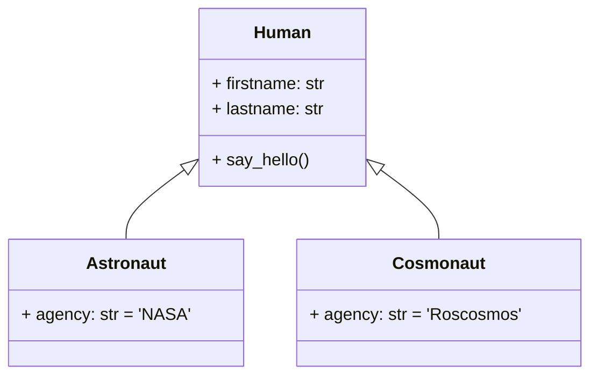

```mermaid
classDiagram

    Human <|-- Astronaut
    Human <|-- Cosmonaut

    class Human {
         + firstname: str
         + lastname: str
         + say_hello()
    }

    class Astronaut {
      + agency: str = 'NASA'
    }

    class Cosmonaut{
      + agency: str = 'Roscosmos'
    }
```